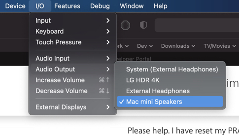

# Wellinks Developer On-Boarding

```
Ruby: 2.7.2
Rails: ~> 6.0.2, >= 6.0.2.1
```

## Setup

Setup **Homebrew** to easily install all the suggested development software.

First install **XCode** and **XCode Tools**

```shell
xcode-select --install
```

Next, install **Homebrew**, which includes **Homebrew Cask**.

Homebrew is a package manager - is not required - you can instead download and install the software listed in this document manually.

#### Install Homebrew

``` Shell
/bin/bash -c "$(curl -fsSL https://raw.githubusercontent.com/Homebrew/install/HEAD/install.sh)"
```

More information about Homebrew can be found here: [Homebrew](https://brew.sh/) / [Homebrew Cask](https://github.com/Homebrew/homebrew-cask/blob/master/USAGE.md) / [Homebrew Installation Instructions](https://docs.brew.sh/Installation)

## Software

### Collaboration

```bash
# Slack
brew install --cask slack
# 1Password
brew install --cask 1password
# Tuple
brew install --cask tuple
# Postman
brew install --cask postman
```

### Suggested

```shell
# Google Chrome
brew install --cask google-chrome

# Rubymine
brew install --cask rubymine
```

## Development Environment Setup

### Ruby Version Manager (RVM)

These are the instructions to install `RVM` (you can alternatively, install `rbenv`)

```shell
# Get GPG
brew install gnupg

# Install public key
gpg --keyserver hkp://pool.sks-keyservers.net --recv-keys 409B6B1796C275462A1703113804BB82D39DC0E3 7D2BAF1CF37B13E2069D6956105BD0E739499BDB

# If this command fails, try the following to fetch the public key
command curl -sSL https://rvm.io/mpapis.asc | gpg --import -
command curl -sSL https://rvm.io/pkuczynski.asc | gpg --import -

# Install RVM
\curl -sSL https://get.rvm.io | bash -s stable --ruby
```

```shell
source ~/.profile
```

To install different versions of ruby and set them as the default

```shell
rvm install 2.7.2
rvm use 2.7.2

# Optionally, you can set a version of Ruby to use as the default for new shells. Note that this overrides the 'system' ruby:
rvm use 2.7.2 --default
```

Verify that your `~/.profile` or `~/.zshrc` contains the following code, otherwise add it.

If you use bash, check your `.bashrc` and `.bash_profile` files, and add it there instead.

```shell
export PATH="$PATH:$HOME/.rvm/bin"
[[ -s "$HOME/.rvm/scripts/rvm" ]] && source "$HOME/.rvm/scripts/rvm"
```

Switch into the project folder and install the project gems


### Postgres

```shell
# Postgres Server + Postgres Mac App + Postgres DB Management Mac App
brew install postgresql && brew install --cask postgres postico
```

### Redis + Resque

```shell
brew install redis
```

### Git

```shell
git config --global color.ui true
git config --global user.name "YOUR NAME"
git config --global user.email "YOUR@EMAIL.com"
# Use default options for the following keygen command (leave blank and just press enter)
ssh-keygen -t rsa -C "YOUR@EMAIL.com"
```

Copy your newly generated SSH key (`pbcopy` copies the piped text to your clipboard)

```shell
cat ~/.ssh/id_rsa.pub | pbcopy
```

Then add it to your GitHub account via the website: https://github.com/settings/ssh

Add your key to the SSH Agent

```shell
eval "$(ssh-agent -s)"
```

Create a config file if one does not already exist, then edit it

`touch ~/.ssh/config && vim ~/.ssh/config`

Paste the following into your SSH Config file

```
Host *
  AddKeysToAgent yes
  IdentityFile ~/.ssh/id_ed25519
```

Add your SSH private key to the ssh-agent and store your passphrase in the OSX Keychain.

```shell
ssh-add -K ~/.ssh/id_ed25519
```

## Backend Codebase Setup

Clone the application

```shell
git clone git@github.com:Wellinks/platform.git
```

Move into the application directory, and run setup

```shell
cd platform
bin/setup
```

Configure `.env.development` based on `.env.template` - you should ping a teammate to get these values.

Seed the local database

```shell
rails db:seed:staging_seeds
```

## Frontend Codebase Setup

Clone the iOS code from GitHub

```shell
git clone git@github.com:Wellinks/patient-app-ios.git
```

Move into the newly cloned `patient-app-ios` folder, and open the project with XCode.

Open the `Patient App.xcodeproj` file in XCode.

Go to `Build Settings > Build Options` and set the **'Validate Workspace'** setting to **'Yes'**

## Accounts

These are the accounts you will need at Wellinks:

- [ ] Exchange (Email)
- [ ] GitHub
- [ ] Heroku
- [ ] Clickup
- [ ] Jira
- [ ] Slack
- [ ] Rollbar
- [ ] 1Password
- [ ] Figma
- [ ] Exos
- [ ] Testflight

## Devices

These are the devices you will need:

- [ ] Spirometer
- [ ] Pulse Oximeter
- [ ] Bluetooth Flyp

## Learning

### Training

#### Accessibility Course

Please work through this course to understand web accessibility.

https://www.udacity.com/course/web-accessibility--ud891

#### Exos HIPPA Training

You will receive an email for this training - it will most likely end up in your spam folder. It is from exoshq.com and must be completed for HIPPA training.

https://exoshq.com/


### Wellinks Version Control (VC) Workflow

TODO: Welllinks GIT workflow: PR's, etc...


## Troubleshooting

### Tuple Audio Issues

It appears that the `Xcode` simulator may cause audio issues, specifically with Tuple (choppy Tuple call audio making Tuple calls unusable).

One way to resolve this, is by switching the simulator audio output to "other" (not your main output). View screenshot below.

If that does not work - you will need to either
  - Close the simulator while on a Tuple call
  - Mute the Tuple audio, and use a phone for audio (IE: Slack Call via mobile Slack app); while only using Tuple for screen-sharing

  

### Postgres Install

If you run into issues with the Postgres Gem, manually specify the location of Postgres on your system.

```shell
gem install pg -v  '1.1.4' -- --with-pg-config=/Applications/Postgres.app/Contents/Versions/latest/bin/pg_config
```

To find the location of postgres

```bash
which postgres
```

To test your Postgres server is setup properly - verify it is not already running, then run the below command, substituting the location of your Postgres installation (you may need to search around `/Users/$(whoami)/Library/Application\ Support/Postgres/` for this):

```shell
postgres -D /Users/$(whoami)/Library/Application\ Support/Postgres/var-13/
```

### Xcode

First, check if XCode is installed.

```shell
xcode-select -p
```

If it is, verify that you are running 12.2 or newer. If not, you will need to upgrade.

More detailed installation can be found here:

https://learn-rails.com/install-rails-mac/1.html

### Nokogiri

Nokogiri is a gem that is a dependency for many other gems. Nokogiri is a gem that requires compilation for your specific operating system (it’s one of the reasons we installed Xcode Command Line Tools). As such, if your system environment doesn't match Nokogiri's requirements, compilation of Nokogiri will fail. If your system is configured properly, you'll be able to compile Nokogiri.

To verify nokogiri can install correctly, simply install it.

```shell
gem install nokogiri
```

If Nokogiri installation fails, it's likely your Xcode Command Line Tools are not installed correctly. The Nokogiri maintainers provide instructions for Installing Nokogiri, they can be found [here](https://nokogiri.org/tutorials/installing_nokogiri.html)
